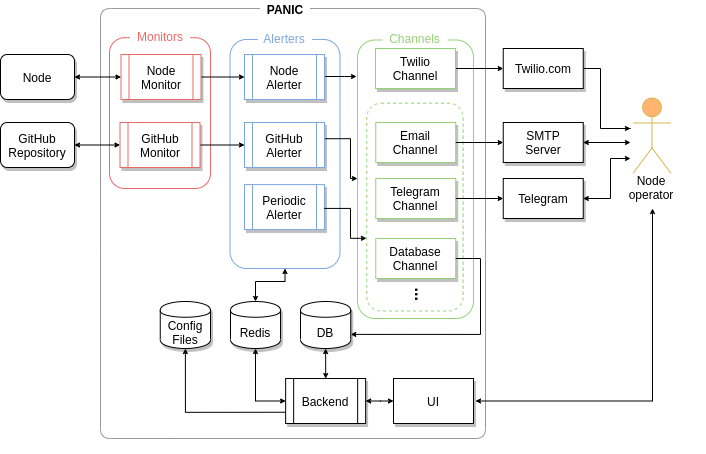
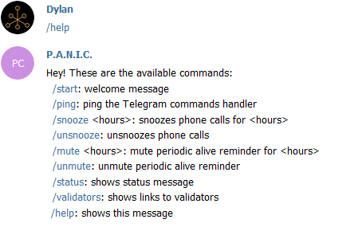
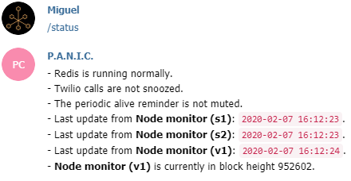

# Design and Features of PANIC

This page will present the inner workings of the alerter as well as the features that one is able to interact with and how. The following points will be presented and discussed:

- [**Design**](#design)
- [**Alerting Channels**](#alerting-channels): (console, logging, Telegram, email, Twilio, database)
- [**Alert Types**](#alert-types): (critical, warning, info, error)
- [**Monitor Types**](#monitor-types): (node, GitHub)
- [**Periodic Alive Reminder**](#periodic-alive-reminder)
- [**Telegram Commands**](#telegram-commands)
- [**Web UI**](#web-ui)
- [**Redis**](#redis)
- [**MongoDB**](#mongodb)
- [**Complete List of Alerts**](#complete-list-of-alerts)

## Design

The diagram below gives an idea of the various components at play when PANIC is running, and how they interact with each other and the node operator:

- **Monitors** extract data from a source and pass it on to the alerters
- **Alerters** store the data (**Redis**) and send alerts to a set of channels
- **Channels** pass on the alerts to the appropriate external service

The user can interact with PANIC using two **User Interfaces**:

- By sending commands to a Telegram chat, where the **Backend** handles and replies to these commands using data stored in **Redis**.
- By using a **Web UI** to check the status of the nodes, view alerts stored in the **DB** in real-time, and configure PANIC to his liking.

## Alerting Channels

PANIC currently supports five alerting channels. By default, only console and logging alerts are enabled, allowing the node operator to run the alerter without having to set up extra alerting channels. This is not enough for a more serious and longer-term alerting setup, for which the node operator should set up the remaining alerting channels.

- **Console**: alerts printed to standard output (`stdout`).
- **Logging**: alerts logged to an alerts log (`logs/alerts/alerts.log`).
- **Telegram**: alerts delivered to a Telegram chat via a Telegram bot.
- **Email**: alerts sent as emails using an SMTP server, with option for authentication.
- **Twilio**: alerts trigger a phone call to grab the node operator's attention.
- **MongoDB**: alerts are persistently stored in a MongoDB database.

Instructions on how to set up the alerting channels can be found in the [installation guide](INSTALL_AND_RUN.md).

## Alert Types

Different events vary in severity. We cannot treat an alert for a new version of Oasis as being on the same level as an alert for validator downtime. PANIC makes use of four alert types:

- **CRITICAL**: the most severe alert and the only type of alert that uses the Twilio phone calling. **Example**: validator has been slashed.
- **WARNING**: a less severe alert but which still requires attention as it may be a warning of an incoming critical alert. **Example**: Validator is not synchronised but is syncing.
- **INFO**: little to zero severity but consists of information which is still important to acknowledge. Info alerts also include positive events. **Example**: increase in bonded balance.
- **ERROR**: triggered by abnormal events and ranges from zero to high severity based on the error that has occurred and how many times it is triggered.

Note that for more advanced users, the alerts internal config file (`config/internal_config_alerts.ini`) lists these severities, allowing users to disable specific alert severities manually. It is unlikely that users will want to disable an entire alert type, but this feature is provided for completeness.

## Monitor Types

An aspect of the design of PANIC that is less visible to the user is that there are multiple monitor types. Once PANIC is started it detects the number of nodes and which chain(s) they belong to, and automatically launches the necessary number of monitors of each type.

- **Node monitor** (one per node): deals with node-specific details such as bonded balance and number of peers.
- **GitHub monitor** (one per repository): uses the GitHub API to keep track of the number of releases in a repository and alerts on a new release.

Each monitor passes on the data that it extracts to the respective alerter. For example, the node monitor passes on its data to the node alerter. The alerter's task is then to keep track of changes in the data to figure out whether or not it should notify the user.

This section will go through each monitor type in greater detail.

### Node Monitor

The node monitor is designed to monitor the state of exactly one validator/full node, such that multiple node monitors are started up if you set up PANIC with multiple nodes.

In PANIC there is a distinction between a node monitor for full nodes and a node monitor for validator. In fact, a node monitor consists of at most three types of monitoring.

- **Direct monitoring** (for both validators and full nodes): the node monitor uses the node that it is monitoring as the data source. **Example**: The number of peers.  
- **Indirect monitoring** (for validators only): the node monitor prioritises the use of other nodes as data sources, and uses the validator node itself as a last resort if the operator sets it as a data source. This is done so that if the validator is experiencing issues, data is still obtained. **Example**: The bonded balance and the number of blocks signed by the validator.
- **Archive monitoring** (for validators only): part of indirect monitoring, but here the node monitor obtains validator data from an archive data source node. This type of monitoring makes the node monitor look into blockchain data from the past. **Example**: Checking whether a validator has been slashed at a particular block height.

In the current design, data source nodes for indirect monitoring can be both validators, full nodes and sentries(if they are configured to store historic data), and these can be set by setting the `use_as_data_source` field as `true` for the desired node in the `config/user_config_nodes.ini` config file. An important note on data source node availability in indirect monitoring is that if for a validator node monitor there are no data source nodes accessible, a `CRITICAL` alert is raised because data could not be obtained. Therefore, having additional data source nodes increases data source redundancy. In addition to this, if no data sources are given, indirect monitoring will be disabled and thus the node monitor only performs direct monitoring.

As it can be deduced from this section, a data source node can be an archive node. The operator can inform PANIC that a node is an archive node by setting the `is_archive_node` variable as true for that data source in the `config/user_config_nodes.ini` config file. An important note with regards to archive monitoring is that PANIC still starts if there is no archive data source node available, however, archive monitoring will be disabled since looking for data in non-archive nodes may raise errors if that non-archive node does not have data from the past. Also, if no archive data source node is accessible in a monitoring round, archive monitoring is disabled until an archive data source node becomes accessible. Therefore, having additional archive data source nodes increases data source redundancy. It is also important that the operator does not set a non-archive node as archive because this may lead to errors.

In a typical monitoring round for validators, the node monitor first performs direct monitoring, then indirect monitoring if enabled, and finally archive monitoring if enabled. On the other hand, in a typical monitoring round for full nodes, the node monitor performs direct monitoring only.

In direct monitoring, the node monitor does the following:

1. Checks if the node is reachable by calling one of the endpoints of the respective API Server.
2. Gets the nodes' data by calling a series of endpoints of the API Server on the node itself.
    1. Gets and stores the is-syncing status
    2. Gets and stores the number of peers
    3. Gets and stores the latest finalized block height
3. Declares the API Server as accessible

If indirect monitoring is enabled, the node monitor does the following:

1. Gets the validators' data by calling a series of API Server endpoints on eligible data source nodes.
    1. Checks and stores whether the validator is still in a list of validators.
    2. Gets and stores the voting power of the validator
    3. Gets the current block and checks the precommits for the validator address.
    4. Gets current events(Escrow, Slashing, Transfers) by block height and checks if the validator address is in there.
    5. Gets and stores the bonding balance.
    6. Gets and stores the debonding balance.
    7. If enabled, performs archive monitoring.
2. Declares the API Server as running.

As already discussed, archive monitoring is part of indirect monitoring. If enabled, during archive monitoring the node monitor does the following: 

1. Chooses an archive data source node `AN`
2. Checks whether the validator has been slashed at a particular block height
    1. Gets the finalized block height `LastH` of `AN`
    2. Sets the height to check *HeightToCheck* = *LastHChecked* + 1 where *LastHChecked* is the height of the last block checked by the node monitor
    3. If *LastH* - *LastHChecked* > `MCUB`:
        1. Sets *HeightToCheck* = *LastH* - `MCUB`
        2. Gets the block hash at height *HeightToCheck* using the API Server
    4. Otherwise if *HeightToCheck* <= *LastH* :
        1. Gets the block hash at height *HeightToCheck* using the API Server
    5. Gets slash amount of validator at height *HeightToCheck*
    6. Alerts if greater than zero.
    7. *LastHChecked* = *HeightToCheck*

Note: 
- If the alerter is not in sync with the archive node with respect to block height, the maximum number of historical blocks checked is `MCUB`, which is configurable from the internal config (`node_monitor_max_catch_up_blocks`).

After performing all types of monitoring, the node monitor concludes by doing the following:

1. Saves both node monitor and node state.
2. Sleeps
    1. If node is validator
        1. Sleeps until the next monitoring round if *LastH*-*LastHChecked* > 2.
    2. else 
        1. Sleeps until the next monitoring round.

Default value:
- `MCUB = node_monitor_max_catch_up_blocks = 500`

### GitHub Monitor

The third monitor type is the slightly less important GitHub monitor which uses the GitHub API to periodically get the number of releases in a repository. This serves as a reminder for the node operator to update their node. Due to GitHub's API limits and the less-critical nature, this monitor does not run as frequently as the other monitors. 

In each monitoring round, the GitHub monitor:

1. Gets the list of the repository's releases from the API, for example: <https://api.github.com/repos/oasislabs/oasis-core/releases>
    1. Gets and stores the number of releases
2. Saves its state
3. Sleeps until the next monitoring round

## Periodic Alive Reminder

The periodic alive reminder is a way for PANIC to inform the operator that it is still running. This can be useful to the operator when no alerts have been sent for a long time, therefore it does not leave the operator wondering whether PANIC is still running or not.

The following are some important points about the periodic alive reminder:

1. The time after which a reminder is sent can be specified by the operator using the setup process described [here](SETUP.md).
2. The periodic alive reminder can be muted and unmuted using Telegram as discussed below.

## User Interfaces

As mentioned earlier, the operator has two main ways to interact with PANIC.

### Telegram Commands

Telegram bots in PANIC serve two purposes. As mentioned above, they are used to send alerts. However they can also accept commands that allow you to check the status of the alerter (and its running monitors), snooze or unsnooze calls, mute or unmute periodic alive reminders, and conveniently get Oasis explorer links to validator lists.

For example, if Redis is running along with three node monitors and one blockchain monitor, with calls not snoozed, and periodic alive reminder not muted, the `/status` command returns the following:

### Web UI

The web UI facilitates the user experience in two ways:
- To help the user monitor his nodes easily at a glance, and watch alerts in real-time.
- To give the user an easy way of setting up PANIC to his liking, and have greater control over the alerter.

For a detailed read on the design and features of the Web UI, please continue reading [here](./UI_DESIGN_AND_FEATURES.md).

## Redis

[Redis](https://redis.io/) is an in-memory key-value store. In the context of the alerter, Redis is used as an in-memory (and thus volatile) copy of a subset of the alerter's state so that:
- The state can be queried, for example to provide a status in Telegram, when the `/status` command is issued.
- When the alerter software restarts or gets restarted, such as to change the configuration, it can continue where it left off.

Included in the alerter state stored in Redis are:
- **For each node:** 
    - Start of downtime, if any
    - Number of peers
    - Bonded balance
    - Debonding balance
    - Shares balance
    - Is-active status
    - Is-syncing status
    - Number of consecutive blocks missed
    - Time of last block signed
    - The `is_missing_blocks` value
    - Time of last block check activity
    - The finalized block height
    - Time of last finalized height change
    - Time of last finalized height check activity
    - The `no_change_in_height_warning_sent` value
- **For each node monitor:**
    - Last update time (to know that the monitor is still running)
    - The last height checked in archive monitoring
- **For each GitHub repository:**
    - Number of releases
- **Unique keys:**
    - Key indicating that [Twilio](#twilio) is snoozed
    - Key indicating that the [PAR](#periodic-alive-reminder) is muted

Keys are grouped mostly by means of key prefixes (one per type of key), but also using [Redis hashes](https://redislabs.com/ebook/part-1-getting-started/chapter-1-getting-to-know-redis/1-2-what-redis-data-structures-look-like/1-2-4-hashes-in-redis/), and a purpose-designed namespace at a global level based on the unique alerter identifier. For example, for an instance of PANIC called "MyPanic", from simplest to most complex:
- The unique Twilio snooze key is simply `MyPanic:tw1` (no hash)
- The Alive Key of a node monitor for "Node 1" would be `MyPanic:nm1_Node 1` (no hash)
- The number of peers of "Node 1" running on "Chain 1" would be `n4_Node 1` (at hash `MyPanic:hash_bc1_Chain 1`)

The namespace prefix (e.g. `MyPanic:`) serves to completely seperate the keys of two or more instances of PANIC that are using the same instance of Redis. As a result, these two instances can monitor happily in their own bubble of keys.

Some keys are given an expiry time. Most notably, the Twilio snooze and alive reminder mute keys are set to expire after the selected time from the point of snoozing/muting. Note that it is not possible to expire a single key within a hash. This is why monitor-related keys (such as `nm2`), some of which are set to expire, were not set up to use a hash.

Instructions on how to set up and secure an instance of Redis can be found in the [installation guide](INSTALL_AND_RUN.md).

Notes:

- For a cleaner and correct execution of the alerter, the operator is encouraged to reset redis (clear all data) using the file `run_util_reset_redis.py` when the chain is either upgraded to a new chain, or in extreme cases when a rollback happens. 
- It is highly discouraged to manually manipulate the values that PANIC stores in Redis as this might cause unexpected behaviour and cause the alerter to send out false alerts.

## MongoDB

[MongoDB](https://www.mongodb.com/what-is-mongodb) is a general-purpose document-based database built for modern application developers. In the context of the alerter, MongoDB is used to persistently store alerts raised by the alerter, so that they can be viewed in real-time in the Web UI.

Each alert stored in a MongoDB database has the following fields:

- **Origin**: the name of the channel from where the alert is raised.
- **Severity**: the severity of the alert.
- **Message**: the alert message.
- **Timestamp**: timestamp in UTC of when the alert was raised.

Notes:

- The Web UI assumes that the alerts are sorted recent-first, so the user is not encouraged to modify/add alerts in the MongoDB database himself.

## Complete List of Alerts

A complete list of alerts will now be presented. These are grouped into sections so that they can be understood more easily. For each alert, the severity and whether it is configurable from the config files is also included.

Note that for more advanced users, the alerts internal config file (`config/internal_config_alerts.ini`) also lists all of the possible alerts and allows users to disable specific alerts manually.
<!-- TODO: add more info once config UI is usable -->

### Access to Nodes

Problems when trying to access nodes start with an info alert stating that there are some delays. If the node is inaccessible two times in a row, a warning (critical if validator) alert is raised. An info alert is raised as soon as the node is accessible again. The alerter declares a node to be inaccessible if the node loses connection with the API Server. This was done because data cannot be retrieved in this case.

What happens if the node is inaccessible during startup? PANIC raises a warning/critical alert if the node is a full/validator node respectively, informing the user that the full node/validator monitor could not be initialized (and hence did not start) because the node is inaccessible.

Another important alert is that if the node monitor (only for validators during indirect monitoring) cannot access any data source node connected to the API Server, they raise a critical alert.

The last two alerts can be explained via the following scenario. Imagine PANIC is monitoring some node `N` and the operator restarts the API server without node `N` for some reason. In the case that `N` is a validator, PANIC informs the user via a critical alert that the validator was not added to the API server. In case that `N` is not a validator, a warning alert is raised. Whenever this issue is resolved, the user is informed via an INFO alert.

In addition to this, if the node monitor is supplied with archive data source nodes and at any monitoring round it cannot access any archive data source node connected with the API Server during archive monitoring, a warning alert is sent by the alerter informing the user that archive monitoring will be disabled until an archive data source node is accessible. When an archive data source node is then accessible, the user is informed with an info alert that archive monitoring is enabled again.

Notes:
- When archive monitoring is disabled, indirect and direct monitoring is still enabled.
- Archive monitoring can be disabled before running PANIC by giving no archive node data source in the `config/user_config_nodes.ini` file.

| Class | Severity | Configurable |
|---|---|---|
| `ExperiencingDelaysAlert` | `INFO` | ✗ |
| `CannotAccessNodeAlert` | `WARNING`/`CRITICAL` | ✗ |
| `StillCannotAccessNodeAlert` | `WARNING`/`CRITICAL` | ✗ |
| `NowAccessibleAlert` | `INFO` | ✗ |
| `NodeInaccessibleDuringStartup` | `WARNING`/`CRITICAL` | ✗ | 
| `CouldNotFindLiveArchiveNodeConnectedToApiServerAlert` | `WARNING` | ✗ |
| `FoundLiveArchiveNodeAgainAlert` | `INFO` | ✗ |
| `FoundLiveArchiveNodeAgainAlert` | `INFO` | ✓ |
| `NodeWasNotConnectedToApiServerAlert` | `WARNING`/`CRITICAL` | ✗ |
| `NodeConnectedToApiServerAgainAlert` | `INFO` | ✗ |

### Bonded Balance (Validator Nodes Only)

Bonded balance change alerts are mostly info alerts. A balance increase is always a positive event, but balance decrease has a special case when the balance goes to 0, in which case a critical alert is raised.

To avoid giving alerts when the bonded balance decreases/increases by a very small amount, the user has the option to set a threshold `T` in the internal config, such that no alerts are given if the increase/decrease is greater than 0 but less than `T`

Default values:
- `T = change_in_bonded_balance_threshold = 1`

| Class | Severity | Configurable |
|---|---|---|
| `BondedBalanceIncreasedAlert` | `INFO` | ✗ |
| `BondedBalanceDecreasedAlert` | `CRITICAL` | ✗ |
| `BondedBalanceIncreasedByAlert` | `INFO` | ✓ |
| `BondedBalanceDecreasedByAlert` | `INFO` | ✓ |

### Debonding Balance (Validator Nodes Only)

Debonding balance alerts are mostly info alerts. To avoid giving alerts when the debonding balance decreases/increases by a very small amount, the user has the option to set a threshold `T` in the internal config, such that no alerts are given if the increase/decrease is greater than 0 but less than `T`

Default values:
- `T = change_in_debonding_balance_threshold = 1`

| Class | Severity | Configurable |
|---|---|---|
| `DebondingBalanceIncreasedAlert` | `INFO` | ✗ |
| `DebondingBalanceDecreasedAlert` | `INFO` | ✗ |
| `DebondingBalanceIncreasedByAlert` | `INFO` | ✓ |
| `DebondingBalanceDecreasedByAlert` | `INFO` | ✓ |

### Shares Balance (Validator Nodes Only)

Shares balance alerts are mostly info alerts. To avoid giving alerts when the shares balance decreases/increases by a very small amount, the user has the option to set a threshold `T` in the internal config, such that no alerts are given if the increase/decrease is greater than 0 but less than `T`

Default values:
- `T = change_in_shares_balance_threshold = 1`

| Class | Severity | Configurable |
|---|---|---|
| `SharesBalanceIncreasedAlert` | `INFO` | ✗ |
| `SharesBalanceDecreasedAlert` | `INFO` | ✗ |
| `SharesBalanceIncreasedByAlert` | `INFO` | ✓ |
| `SharesBalanceDecreasedByAlert` | `INFO` | ✓ |

### Number of Peers

Alerts for changes in the number of peers range from info to critical.
#### For Validator Nodes
- Any decrease to `N` peers inside a configurable danger boundary `D1` is a critical alert (i.e. `N <= D1`). 
- Any decrease to `N` peers inside a configurable safe boundary `S1` is a warning alert (i.e. `D1 < N <= S1`).
- Any increase to `N` peers inside a configurable safe/danger boundary `S1`/`D1` raises an info alert (i.e. `N <= S1/D1`)
- When the number of peers `N` exceeds `S1`, the operator is notified with a one time info alert to not expect any further alerts if the number of peers remains greater than `S1` irrespective of an increase or decrease.
#### For Non-Validator Nodes 
- Any decrease to `N` peers inside a configurable danger boundary `D2` raises a warning alert (i.e. `N <= D2`). Otherwise, any other decreases raises no alerts.
- Any increase to `N` peers inside a configurable danger boundary `D2` raises an info alert (i.e. `N <= D2`). Otherwise, any other increase raises no alerts.
- When the number of peers `N` exceeds `D2`, the operator is notified with a one time info alert to not expect any further alerts if the number of peers remains greater than `D2` irrespective of an increase or decrease.

Default values:
- `D1 = validator_peer_danger_boundary = 5`
- `D2 = full_node_peer_danger_boundary = 5`
- `S1 = validator_peer_safe_boundary = 10`

| Class | Severity | Configurable |
|---|---|---|
| `PeersIncreasedAlert` | `INFO` | ✓ |
| `PeersIncreasedOutsideDangerRangeAlert` | `INFO` | ✓ |
| `PeersIncreasedOutsideSafeRangeAlert` | `INFO` | ✓ |
| `PeersDecreasedAlert` | `WARNING`/`CRITICAL` | ✓ |

### Is syncing

A node is syncing if it was offline for a while and needs to synchronise with the chain, or when it is not keeping up. A warning and info alert are raised when the node starts and stops syncing, respectively.

| Class | Severity | Configurable |
|---|---|---|
| `IsSyncingAlert` | `WARNING` | ✗ |
| `IsNoLongerSyncingAlert` | `INFO` | ✗ |

### Validations (Validator Nodes Only)

Validation alerts are meant to help the operator monitor the behaviour of a validator and that it is performing it's duties correctly.

#### Is Active 

A validator is active if it is in the validator set. When a validator is no longer part of the validator set, a critical alert is raised since the validator is no longer allowed to perform its duties. When the validator then enters the validator set, the operator is informed by an info alert.

| Class | Severity | Configurable |
|---|---|---|
| `ValidatorIsNowActiveAlert` | `INFO` | ✗ |
| `ValidatorIsNotActiveAlert` | `CRITICAL` | ✗ |

#### Missing Blocks (Validator Nodes Only)

The alert for missing blocks is the alert with most possibilities. It is an info alert from 2 missed blocks up to a configurable danger boundary `D`. Once `D` is reached or exceeded, the severity of any further alert is higher:
- a minor alert for `5` missed blocks, if inside danger range (`D <= 5`)
- a major alert for every `10N` missed blocks for `N >= 1`, if inside danger range (`D <= 10N`).

A timed missed blocks alert is also implemented, where if more than `M` blocks are missed within a time interval `T` (both configurable), a major alert is raised. Once the validator is no longer missing blocks, an info alert is raised.

Default values:
- `D = missed_blocks_danger_boundary = 5`
- `M = max_missed_blocks_in_time_interval = 10`
- `T = max_missed_blocks_interval_seconds = 120`

| Class | Severity | Configurable |
|---|---|---|
| `MissedBlocksAlert` | `INFO`/`MINOR`/`MAJOR`| ✓ |
| `TimedMissedBlocksAlert` | `MAJOR` | ✓ |
| `NoLongerMissingBlocksAlert` | `INFO` | ✗ |

#### Voting Power (Validator Nodes Only)

Voting power change alerts are mostly info alerts; voting power increase is always a positive event, but voting power decrease has a special case where voting power goes to 0, in which case a major alert is raised.

| Class | Severity | Configurable |
|---|---|---|
| `VotingPowerIncreasedAlert` | `INFO` | ✗ |
| `VotingPowerDecreasedAlert` | `MAJOR` | ✗ |
| `VotingPowerIncreasedByAlert` | `INFO` | ✗ |
| `VotingPowerDecreasedByAlert` | `INFO` | ✗ |

#### Events

Events occur whenever something happens to the balance of the validator, the tokens can be slashed/burned/transfered/escrowed/reclaimed. PANIC will raise a critical alert whenever the tokens are slashed or burned, otherwise, in all other cases an info alert is raised.

| Class | Severity | Configurable |
|---|---|---|
| `SlashedAlert` | `CRITICAL` | ✗ |
| `TokensBurnedAlert` | `CRITICAL` | ✗ |
| `TokensTransferedToAlert` | `INFO` | ✗ |
| `TokensTransferedFromAlert` | `INFO` | ✗ |
| `EscrowAddEventSelfOwner` | `INFO` | ✗ |
| `EscrowAddEventSelfEscrow` | `INFO` | ✗ |
| `EscrowReclaimEventSelfOwner` | `INFO` | ✗ |
| `EscrowReclaimEventSelfEscrow` | `INFO` | ✗ |
| `UnknownEventFound` | `WARNING` | ✗ |

### Finalized Block Height

Another important component to monitor is the finalized block height of a node. Whenever the finalized block height of a node is not updated for a long time, this means that either the finalization algorithm is not working as intended, or that the node is not behaving as expected, where in the case of a validator this might mean that the validator is finding it difficult to declare the block as finalized. In PANIC this functionality is implemented as follows.

**For validators**:

- If the finalized block height was not updated for `W` seconds, PANIC raises a warning alert.
- If the finalized block height was not update for `I` > `W` seconds, PANIC raises a critical alert every `I` seconds.

**For non-validators**:

- If the finalized block height was not updated for `W` seconds, PANIC raises a warning alert.
- If the finalized block height was not update for `I` > `W` seconds, PANIC raises a warning alert every `I` seconds.

In both the cases above if PANIC raises an alert that the finalized block height of a node is not being updated and then the finalized block height of a node gets updated, the operator is informed via an info alert

Default values:
- `W = no_change_in_height_first_warning_seconds = 180`
- `I = no_change_in_height_interval_seconds = 600`

 | Class | Severity | Configurable |
|---|---|---|
| `NodeFinalizedBlockHeightDidNotChangeInAlert` | `WARNING/CRITICAL` | ✓ |
| `NodeFinalizedBlockHeightHasNowBeenUpdatedAlert` | `INFO` | ✗ |

### Twilio

The alerter also has some Twilio-specific alerts. Any issue with calling, which only happens during a critical alert, raises another critical alert.

| Class | Severity | Configurable |
|---|---|---|
| `ProblemWhenDialingNumberAlert` | `CRITICAL` | ✗ |
| `ProblemWhenCheckingIfCallsAreSnoozedAlert` | `CRITICAL` | ✗ |

### GitHub

The only two alerts raised by the GitHub alerter are an info alert when a new release is available, and an error alert when there are issues with accessing a repository's releases page.

If a repository's releases page is inaccessible during startup, a warning alert is raised by PANIC, informing the operator that the GitHub monitor could not be initialized (and hence did not start) because the repository's releases page is inaccessible.  

| Class | Severity | Configurable |
|---|---|---|
| `NewGitHubReleaseAlert` | `INFO` | ✗ |
| `CannotAccessGitHubPageAlert` | `ERROR` | ✗ |
| `RepoInaccessibleDuringStartup` | `WARNING` | ✗ |

### Periodic Alive Reminder

If the periodic alive reminder is enabled from the config file, and PANIC is running smoothly, the operator is informed every time period that PANIC is still running via an info alert.

The periodic alive reminder always uses the console and logger to raise this alert, however, the operator can also receive this alert via Telegram, Email or both, by modifying the config file as described [here](SETUP.md).

| Class | Severity | Configurable |
|---|---|---|
| `AlerterAliveAlert` | `INFO` | ✓ |

### API Server

Since PANIC accesses the nodes via the API Server, a node may not be accessible due to the fact that PANIC has lost connection with the API server. More often than not, this happens when for some reason the API Server has stopped executing. Whenever this happens, warning alerts are raised for each monitor that cannot retrieve data. In addition to this, if 15 seconds pass since the API server was initially down, the validator node monitors send critical alerts to inform the operator that the validators cannot be monitored. In the background, PANIC keeps on trying to connect with the API Server and whenever the connection is re-established, the user is informed via an info alert.

| Class | Severity | Configurable |
|---|---|---|
| `ApiIsDownAlert` | `WARNING`/`CRITICAL` | ✗ |
| `ApiIsUpAgainAlert` | `INFO` | ✗ |

### Other (Errors)

Last but not least is a set of error alerts, including read errors when gathering data from a node, termination of a component of the alerter (e.g. a monitor) due to some exception, and any problem experienced when using Telegram bots. 

Another error alert may be raised in archive monitoring. This occurs when the node monitor chooses a node that the operator set as an archive node but in reality it is not. When this happens, PANIC attempts to find another archive node and continues running normally if successful.

| Class | Severity | Configurable |
|---|---|---|
| `TerminatedDueToExceptionAlert` | `ERROR` | ✗ |
| `TerminatedDueToFatalExceptionAlert` | `ERROR` | ✗ |
| `ProblemWithTelegramBot` | `ERROR` | ✗ |
| `NodeIsNotAnArchiveNodeAlert` | `ERROR` | ✗ |

---
[Back to front page](../README.md)